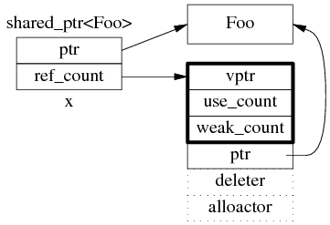
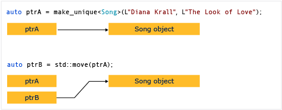
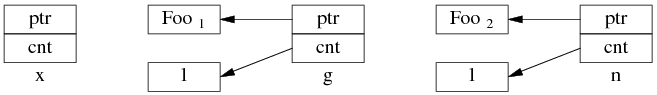
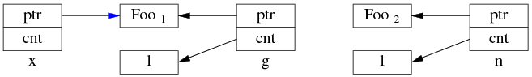
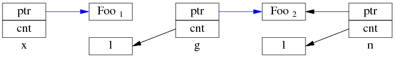
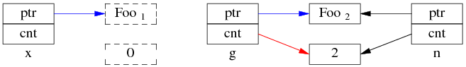
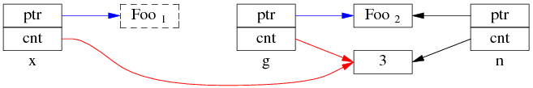

[TOC]


# 1 智能指针

## 1.0 原始指针的缺陷

* 声明中**未指出指向**的是**单个**对象还是**数组**

* 没有提示**使用完对象后是否需要析构**，从声明中**无法看出指针是否拥有对象**

* **不知道析构该使用 delete 还是其他方式**（比如传入一个专门用于析构的函数）

* 即使知道了使用 delete，**也不知道 delete 的是单个对象还是数组**（使用 delete[]）

* **难以保证**所有路径上**只产生一次析构**

* **没有检查空悬指针的办法**

* **智能指针解决了这些问题**，它封装了原始指针，行为看起来和原始指针类似但大大减少了犯错的可能

* > C++17 中有三种智能指针：[std::shared_ptr](https://en.cppreference.com/w/cpp/memory/shared_ptr)、[std::unique_ptr](https://en.cppreference.com/w/cpp/memory/unique_ptr)、[std::weak_ptr](https://en.cppreference.com/w/cpp/memory/weak_ptr) 
  >
  > auto_ptr被弃用了
  
* 优先考虑**使用`std::make_unique**`和`**std::make_shared**`而非`new`

## 1.1 RAII 与引用计数

 **RAII** :在构造函数的时候申请空间，而在析构函数（在离开作用域时调用）的时候释放空间，
也就是我们常说的 RAII 资源获取即初始化技术。

**引用计数**基本想法是对于动态分配的对象，进行引用计数，每当增加一次对同一个对象的引用，那么引用对象的引用计数就会增加一次，
每删除一次引用，引用计数就会减一，当一个对象的引用计数减为零时，就自动删除指向堆内存。

## 1.2 `std::shared_ptr`

**shared_ptr 的数据结构**

 shared_ptr 是引用计数型（reference counting）智能指针,多数实现都采用在堆（heap）上放个计数值（count）的办法.

- shared_ptr<Foo> 包含两个成员 
    - 一个是指向 Foo 的指针 ptr，
    - 一个是 ref_count 指针 
- ref_count 对象有多个成员，具体的数据结构如图所示，其中 deleter 和 allocator 是可选的 .



消除显示的调用 
`delete`，当引用计数变为零的时候就会将对象自动删除。

`std::make_shared` 会分配创建传入参数中的对象，
并返回这个对象类型的`std::shared_ptr`指针。

- **`std::make_shared` 就能够用来消除显式的使用 `new`，**
- 通过 `get()` 方法来获取原始指针
- 通过 `reset()` 来减少一个引用计数
- 通过`use_count()`来查看一个对象的引用计数

```cpp
#include <iostream>
#include <memory>
struct Foo {
    int _value = 0;
    Foo(int value):_value(value) { std::cout << __func__ <<"(" << _value<< ")\n"; }
    ~Foo() { std::cout << __func__ <<"("<< _value<< ")\n"; }
    void Printf() { std::cout << __func__ <<"("<< _value<<")\n"; }
};

void func(std::shared_ptr<Foo> ptr){
    std::cout << __func__ <<std::endl;
    ptr->Printf();
}

void func_unique_ptr(std::unique_ptr<Foo> ptr){
    std::cout << __func__ <<std::endl;
    ptr->Printf();
}

int main()
{
    // auto ptr = new int(10); // illegal, no direct assignment
    // Constructed a std::shared_ptr
    auto ptr = std::make_shared<Foo>(10);
    func(ptr);

    auto ptr2 = ptr; // 引用计数+1
    Foo *p = ptr.get(); // 这样不会增加引用计数

    std::cout << "ptr.use_count() = " << ptr.use_count() << std::endl; // 2
    std::cout << "ptr2.use_count() = " << ptr2.use_count() << std::endl; // 2

    ptr2.reset(new Foo(20));
    std::cout << "ptr.use_count() = " << ptr.use_count() << std::endl; // 1
    std::cout << "ptr2.use_count() = "<< ptr2.use_count() << std::endl; // 1
    std::cout << "reset ptr2:" << std::endl;
    //ptr2 = nullptr;
    ptr2.reset();
    //~Foo(20)
    std::cout << "ptr.use_count() = " << ptr.use_count() << std::endl; // 1
    std::cout << "ptr2.use_count() = "<< ptr2.use_count() << std::endl; // 0
    //~Foo(10)
    // The shared_ptr will be destructed before leaving the scope
    return 0;
}

```

## 1.3 `std::unique_ptr`

**`std::unique_ptr` 是一种独占的智能指针**



```cpp
std::unique_ptr<int> pointer = std::make_unique<int>(10); // make_unique 从 C++14 引入
std::unique_ptr<int> pointer2 = pointer; // 非法,不可复制
std::shared_ptr<int> p = std::make_unique<int>(42); // unique_ptr转为shared_ptr
```

> `make_unique` 并不复杂，C++11 没有提供 `std::make_unique`，可以自行实现：
>
> ```cpp
> template<typename T, typename ...Args>
> std::unique_ptr<T> make_unique( Args&& ...args ) {
> return std::unique_ptr<T>( new T( std::forward<Args>(args)... ) );
> }
> ```
>
> 至于为什么没有提供，C++ 标准委员会主席 Herb Sutter 在他的[博客](https://herbsutter.com/gotw/_102/)中提到原因是因为『被他们忘记了』。

**既然是独占，换句话说就是不可复制**。但可 `std::move` 将其转移给其他的 `unique_ptr`，例如：

```cpp
#include <iostream>
#include <memory>

struct Foo { // object to manage
    int _value = 0;
    Foo(int value):_value(value){ std::cout << __func__ <<"(" << _value<< ")\n"; }
    Foo() { std::cout << "Foo ctor\n"; }
    Foo(const Foo&) { std::cout << "Foo copy ctor\n"; }
    Foo(Foo&&) { std::cout << "Foo move ctor\n"; }
    ~Foo() { std::cout << "~Foo("<< _value<< ")\n"; }
    void printf() { std::cout << "printf("<< _value<<")\n"; }
};

void func(std::unique_ptr<Foo> ptr){
    ptr->printf();
    // The unique_ptr will be destructed before leaving the scope
}

int main()
{
    // Constructed a std::make_unique
    auto ptr = std::make_unique<Foo>(10); //C++14
    func(std::move(ptr)); //Printf(10) ~Foo(10)
    //func(ptr); //error
    std::cout << "###########\n";
    //~Foo(10)
    std::unique_ptr<Foo> p1 { new Foo{20} }; //C++11,
    p1->printf();
    //~Foo(20)
    return 0;
}
```

[std::unique_ptr](https://en.cppreference.com/w/cpp/memory/unique_ptr)的**析构默认通过 delete** 内部的原始指针完成，但**也可以自定义删除器**，删除器需要一个[std::unique_ptr](https://en.cppreference.com/w/cpp/memory/unique_ptr)**内部指针类型的参数**

```c++
class A {};
auto f = [](A* p) { std::cout << "destroy\n"; delete p; };//删除器

std::unique_ptr<A, decltype(del)> makeA(){
    std::unique_ptr<A, decltype(f)> p(new A, f); //
    return p;
}
```

默认情况下，[std::unique_ptr](https://en.cppreference.com/w/cpp/memory/unique_ptr)和原始指针尺寸相同，如果自定义删除器则[std::unique_ptr](https://en.cppreference.com/w/cpp/memory/unique_ptr)会加上删除器的尺寸。一般无状态的函数对象（如无捕获的 lambda）不会浪费任何内存，**lambda作为删除器可以节约空间**

## 1.4 `std::weak_ptr`

如果你仔细思考 `std::shared_ptr` 就会发现依然存在着资源无法释放的问题。看下面这个例子：

```cpp
#include <iostream>
#include <memory>

struct A;
struct B;

struct A {
    std::shared_ptr<B> pointer;
    ~A() {
        std::cout << "~A" << std::endl;
    }
};
struct B {
   // std::weak_ptr<A> pointer;
    std::shared_ptr<A> pointer;
    ~B() {
        std::cout << "~B" << std::endl;
    }
};

int main() {
    auto a = std::make_shared<A>();
    auto b = std::make_shared<B>();
    a->pointer = b;
    b->pointer = a;
}
```

运行结果是 A, B 都不会被销毁，这是因为 a,b 内部的 pointer 同时又引用了 `a,b`，这使得 `a,b` 的引用计数均变为了 2，而离开作用域时，`a,b` 智能指针被析构，却只能造成这块区域的引用计数减一，这样就导致了 `a,b` 对象指向的内存区域引用计数不为零，而外部已经没有办法找到这块区域了，也就造成了内存泄露，如图 5.1：


解决这个问题的办法就是使用弱引用指针 `std::weak_ptr`，`std::weak_ptr`是一种弱引用（相比较而言 `std::shared_ptr` 就是一种强引用）。弱引用不会引起引用计数增加，当换用弱引用时候，最终的释放流程如图 5.2 所示：


在上图中，最后一步只剩下 B，而 B 并没有任何智能指针引用它，因此这块内存资源也会被释放。

`std::weak_ptr` 没有 `*` 运算符和 `->` 运算符，所以不能够对资源进行操作，它的唯一作用就是用于检查 `std::shared_ptr` 是否存在，**其 `expired()` 方法能在资源未被释放时，会返回 `true`，否则返回 `false`。**

## 1.6 多线程无保护读写 shared_ptr 可能出现的 race condition

考虑一个简单的场景，有 3 个 shared_ptr<Foo> 对象 x、g、n：

```c++
std::shared_ptr<Foo> g(new Foo); // 线程之间共享的 shared_ptr
std::shared_ptr<Foo> x; // 线程 A 的局部变量
std::shared_ptr<Foo> n(new Foo); // 线程 B 的局部变量
```

一开始，各安其事。



线程 A 执行 x = g; （即 read g），以下完成了步骤 1，还没来及执行步骤 2。这时切换到了 B 线程。



同时编程 B 执行 g = n; （即 write g），两个步骤一起完成了。

先是步骤 1：



再是步骤 2：



这是 Foo1 对象已经销毁，x.ptr 成了空悬指针！

最后回到线程 A，完成步骤 2：



多线程无保护地读写 g，造成了“x 是空悬指针”的后果。这正是多线程读写同一个 shared_ptr 必须加锁的原因。

## [参考文献]

1. [stackoverflow 上关于『C++11为什么没有 make_unique』的讨论](http://stackoverflow.com/questions/12580432/why-does-c11-have-make-shared-but-not-make-unique)
2. https://www.cnblogs.com/Solstice/archive/2013/01/28/2879366.html

